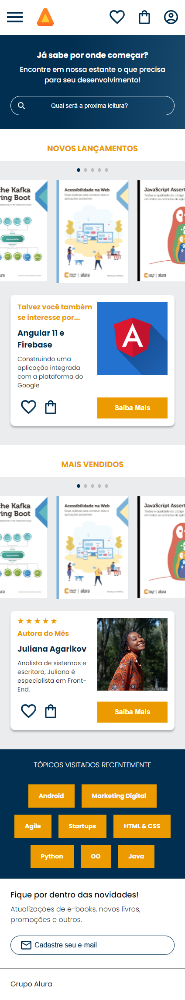

# AluraBooK

## Sobre o Projeto

Projeto desenvolvido no curso de HTML e CSS: responsividade com mobile-first da plataforma de ensino Alura.

### O que é o projeto

Construção de um site para um e-commerce de uma livraria online especializada em livros sobre tecnologia.

### Aprendizado

Foi aprendido o conceito de mobile first no desenvolvimento web, que consiste em iniciar a implementação pensando primeiro na experiência dos usuários de dispositivos móveis. Posteriormente, incrementam-se os recursos e adapta-se o design à medida que se aumenta o tamanho e alteram-se as características da tela.

## Tecnologias Utilizadas

- HTML5,
- CSS3
- Biblioteca SwiperJS

## Imagem do Projeto

